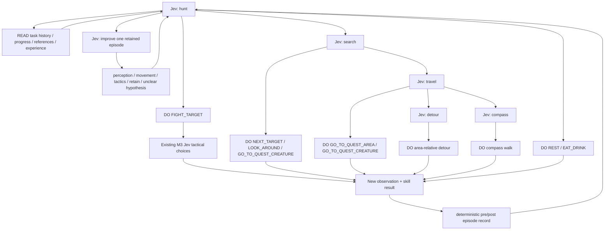

# Runtime: Jev chooses; native tools carry out the choice

This is the runtime entry point, not another agent framework. Languages do not
own architectural roles. `Runtime.swift` keeps task/evidence contracts, `Input.swift`
keeps input ownership, `DecisionGraph.swift` lets Jev choose **information,
branching, or skills**, and `Experience.swift` retains bounded pre/post outcomes for
optional later recall. The existing Fight/Nav/Hunt implementations remain tools.

## Implemented slice

`skyborne-hunt.graph.json` is an opt-in candidate for the actual native `runHunt`.
One `GraphSession` lasts for a hunt. It retains the selected question path and the
IDs of requested references, not old position/health/inventory readings. Every new
skill decision starts from the caller's new observations. Within one lookup chain,
the input is one frozen pre-action snapshot; lookup does not turn it into fresh
vision. The existing executive re-reads the game before dispatching the chosen skill.

Every Jev reply chooses an exact key in the current tool menu:

| Output | Meaning | Next input |
| --- | --- | --- |
| `READ:recent` | Retrieve named task history | The next Jev call includes that history |
| `READ:class_conflicts` | Consult a source-qualified local reference | The next call includes the requested Markdown section |
| `ENTER:travel` | Delegate to a narrower question | Only that node's menu is presented |
| `BACK` | Reconsider the parent goal | Parent menu, with loaded references retained |
| `DO:LOOK_AROUND` | Invoke an existing bounded composite skill | New visual observations and the actual skill result |

The model does not generate file paths or key timings. Concrete tool arguments
are the supplied candidates; future candidate builders can offer parameterised
skills or named map/equipment records. A new menu is not a new physical capability.
References are snapshotted once from the trusted local repo configuration and
loaded into model context only when selected. Snapshot resources refresh their
values from each new input; absent values remain null. Loaded READ options are
removed to avoid spending another call fetching the same data. Jev can act directly
without a lookup, remain inside a subgoal for successive skills, or return upward.
This gives a sequence of adaptive skill choices, **not a blind queued combo**.

### Current executable graph (abbreviated)



`BACK` edges and local READ edges are omitted above. The session actually retains
its selected node after a skill; new observations can prompt BACK. `ToolGraph.mermaid()`
renders the exact catalogue, including all skills, reads and child edges. The test
binary's `--graph` option prints it. There is no independent graph database or editor.

## Experience loop: self-improvement without model weight updates

`Experience.swift` adds one bounded, local episodic cache. After an existing Hunt
skill actually executes, native code records the coarse pre-action situation, the
selected skill, its reported result, whether a walk was observed blocked, elapsed
time and a later observation when one is available. Missing post-action vision or
a missing objective line remains unknown. Recording an outcome performs no model
call and does not turn one success/failure into a rule.

On the next decision the compact `experience_index` is always visible. It reports
whether comparable retained cases exist, but not all episode detail. Jev may then
choose `READ:experience`; only the following request receives up to three contrasting
cases (latest, blocked and objective-progress examples) plus per-action counts. The
matching key uses explicit coarse screen-derived buckets such as combat/recovery
phase, health/mana band, selected-target kind, quest-area relation, nearby hostiles,
blocked-heading presence and a coarse zone-map cell. It is deliberately not semantic
similarity, causal attribution or a calibrated success probability.

Jev may also enter the `improve` node. Its outputs are deliberately narrow:
`REVIEW_PERCEPTION`, `REVIEW_MOVEMENT`, `REVIEW_TACTICS`, `RETAIN_EXAMPLE` or
`REVIEW_UNCLEAR`. This stores a hypothesis/bookmark tied to the exact episode, posts
no game input, then returns the graph to the Hunt root. It cannot write Swift, create
new skills, edit the graph or promote a tactic. A later human/LLM development pass
can use these queued cases to propose code, decoder, reference or policy changes;
those changes still need ordinary source review and evidence before becoming runtime
inputs. This separates immediate non-parametric adaptation from slower software
improvement.

The store is opt-in and local:

```sh
# First run accumulates episodes; later runs can choose READ:experience.
/tmp/m4-nav --hunt-dry-run \
  --graph experiments/002_wow_visual/runtime/skyborne-hunt.graph.json \
  --experience /tmp/skyborne-hunt-experience.json
```

The file is scoped to the graph/profile ID. A differently scoped runtime does not
silently import it. It holds at most 256 retrieval cases; full run evidence remains
in each run's event log. This slice does not demonstrate that retrieval improves
win rate, latency or token use. That requires comparable episodes with and without
retrieval. It also does not yet feed experience into the nested M3 combat choices,
create new motor skills, or consolidate cases into a promoted strategy.

The design borrows mechanisms, not code, from several lifelong-agent lines of work:
Voyager stores reusable executable skills and improves them from execution feedback;
Reflexion retains trial feedback in episodic memory; ExpeL gathers experience and
recalls extracted insights; MemRL separates a stable reasoner from plastic episodic
memory with feedback-derived utility; and ProactAgent treats retrieval itself as an
explicit action. Our first slice keeps only the cheapest testable pieces: structured
episodes, optional retrieval, contrasting outcomes and a typed request for later
analysis. References: https://arxiv.org/abs/2305.16291,
https://arxiv.org/abs/2303.11366, https://arxiv.org/abs/2308.10144,
https://arxiv.org/abs/2601.03192 and https://arxiv.org/abs/2604.20572.
No implementation from those projects is copied and no dependency is added.

## Run and compare

Build the native M4 binary with the current [M4 instructions](../m4/README.md).
From the repo root:

```sh
# Pure simulation, canned choices, no key, game, capture or provider:
/tmp/m4-nav --hunt-dry-run --graph experiments/002_wow_visual/runtime/skyborne-hunt.graph.json \
  --experience /tmp/skyborne-hunt-experience.json
# Existing flat baseline remains unchanged:
/tmp/m4-nav --hunt-dry-run
```

The no-network demo traverses the real graph and real Hunt core with simulated
inputs. It may end at a call/decision limit; it is not a learned policy or a success
rate. SimHunt still has a canned fight outcome, NOT simulated M3 combat.

The same `--graph PATH` argument is wired to `--hunt-sim-jev` (real provider,
simulated world) and `--hunt --keys wqe` (real game). These are not run in this PR.
They retain their existing separate run authority and effects; file selection does
not start a game or grant an execution envelope. No new permission system was added.

There is one provider call for each selected READ/ENTER/BACK/DO edge. The sample
allows four calls per skill decision, 120 per hunt-policy session, within the
existing ten-second decision deadline. This is a starting cost envelope, not a
claim that four hops fit every real-time action. Graph-mode Hunt HTTP requests do
not retry. Warm-up and nested Fight requests remain separate from this graph budget.
Failed graph attempts are recorded. Exhaustion/error ends the candidate; there is
no silent rules replacement. Flat baseline defaults and existing input checks are
unchanged. No second confidence checker or safety framework is introduced.

`graph_call` events and `jev.jsonl` retain each exact request, actual response,
reference content used, node and latency. The final tool distribution is NOT padded
with zeroes or multiplied into a made-up probability of an action/success. Manifest
`graph_requests` counts these calls; `graph_usage_missing` counts missing usage
receipts. Token totals sum returned usage only and exclude unreported failed usage.
The inherited manifest does not account for warm-up usage or retries inside legacy
nested Fight; do not call it a complete invoice. Judge the new policy against flat
Jev on comparable episodes, not by the canned demo's path or CI test count.

## Extension direction, NOT completed capability

The intended wider hierarchy is owner goal -> Jev subgoal/tool choices -> selected
specialist decisions -> native skills -> new evidence. Add branches only when an
actual tool and meaningful task observation exist:

- Quest types: hunt, interact, collect, escort, puzzles and quest-specific references.
  Hunt is connected. Quest hand-ins within one walk are connected through [the quest graph](skyborne-quest.graph.json) (M4f); accepting, kill/collect/use-at quests and zone travel are not.
- Travel: route selection, local approach, obstacle recovery and location-specific
  references. Existing calibrated walks are connected; bridge/cliff geometry is NOT solved.
- Combat: tactical choices, learned abilities, movement, adds, buffs/debuffs and party
  context. M3 remains its existing Jev loop. It has no general party/debuff interpreter.
- Professions: fishing, skinning, mining, crafting. Fishing exists separately; none
  is made a selectable graph tool merely by listing it in this roadmap.
- Memory/tools: last observed inventory/equipment, visited map, skill/reference index,
  task history. History/progress/navigation, one qualified reference section and the
  bounded Hunt experience cache are connected here. Inventory/equipment/map memory
  remain future tools. No hidden game-state source or generic LLM is involved.

The catalogue profile names Skyborne Shaman, but this is NOT qualification of all
level 1-20 spells, races, quest types or environments. Adding another profile means
new data plus supported skill adapters and evidence, not copying a name into JSON.

The inherited `huntAdmissible` still mixes technical preconditions and legacy
strategic restrictions (including health/nearby-hostile gates). This slice does not
relax them or claim complete tactical freedom. Policy/profile separation and shared
live/replay reference versions remain [#23](https://github.com/fol2/jev-playground/issues/23).
A model choice can be precise syntactically while wrong tactically; exact output
means a definite tool invocation, not guaranteed interpretation or gameplay success.

## References and licence decision

TypeSafe's [primitives](https://docs.typesafe.ai/primitives#when-one-question-depends-on-another)
require a later request when a lookup changes the evidence/options. Independent
questions on the same state can instead be batched; don't infer an answer-to-answer
dependency inside one request. Their [skill suggestion](https://docs.typesafe.ai/cookbooks/skill_suggestion)
uses progressive disclosure, and [jaggedness](https://docs.typesafe.ai/model-jaggedness/jev-1.13)
explains why huge state dumps and generating free-form plans are poor defaults.
These are design references, not WoW success evidence. Checked 24 September 2026.

No external implementation was copied and no dependency was added. A full behaviour-
tree/agent framework would duplicate the small native host interfaces without giving
us WoW perception or movement. Existing attributed MIT input code remains untouched.
